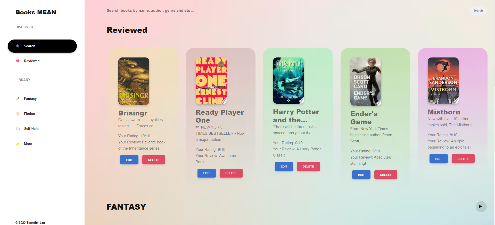
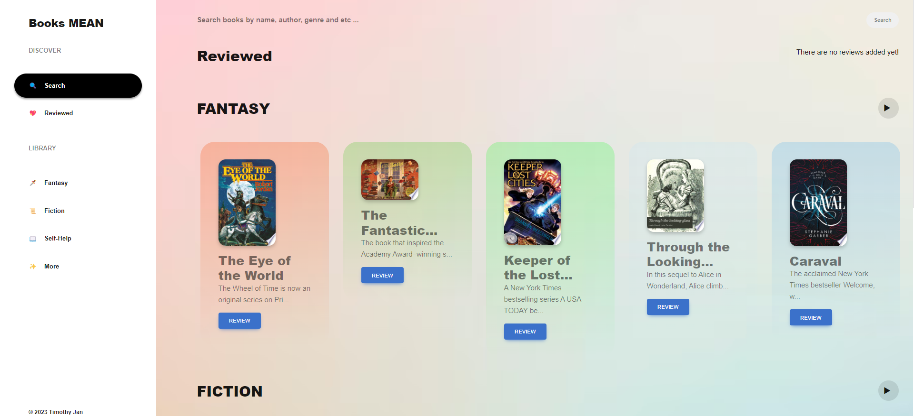
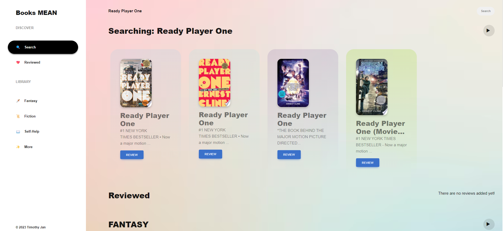
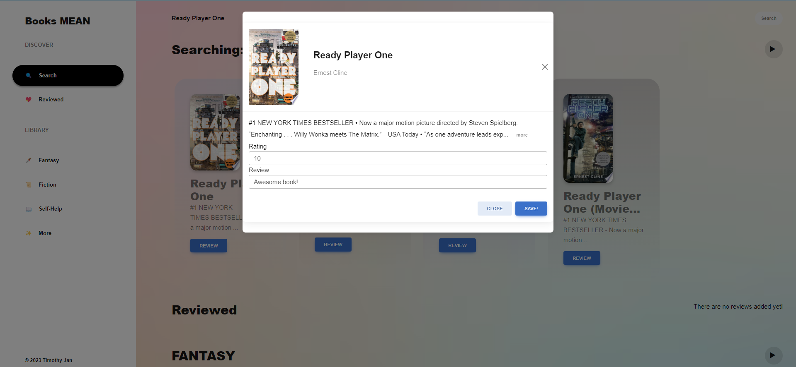
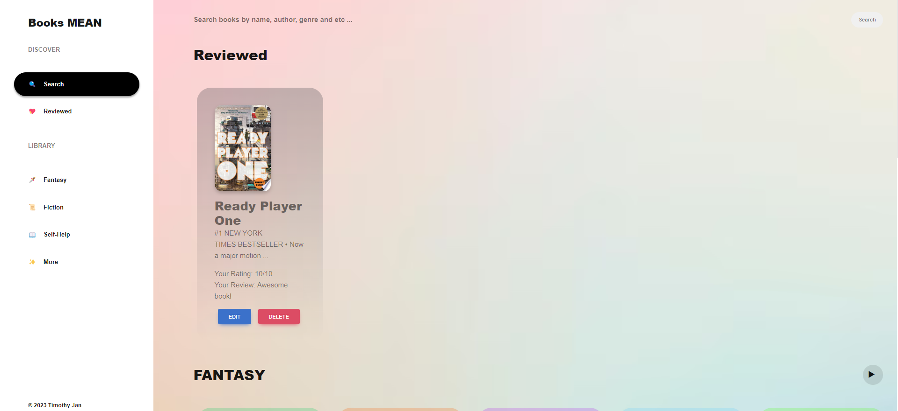
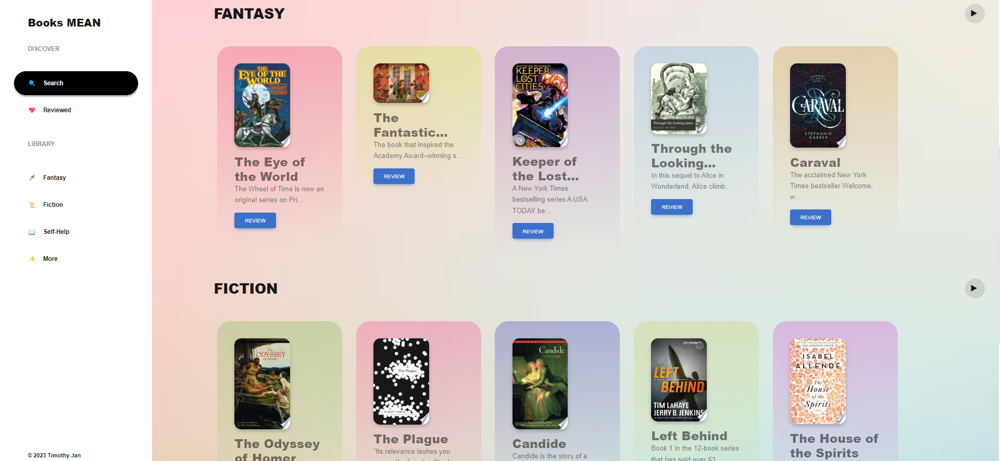

# Books-Angular
Book management system - Angular CRUD app using Google Books API, Express, Angular, Node, and MDBootstrap 5. Deployed version without using MongoDB.
<a href="https://github.com/TimothyJan/Books-MEAN" target="_blank">Books-MEAN</a> contains the files for version using MongoDB.

Frontend:
<ul>
  <li>Start Frontend ~<code>ng serve</code></li>
  <li>Angular frontend - <a href="http://localhost:4200">http://localhost:4200</a></li>
  <li><a href="https://mdbootstrap.com/docs/standard/getting-started/installation/">Mdbootstrap Installation</a></li>
</ul>

<h3>Some of my fav books</h3>

<h3>Home</h3>

<h3>Search</h3>

<h3>Review</h3>

<h3>Review-List</h3>

<h3>Explore Other Genres!</h3>

